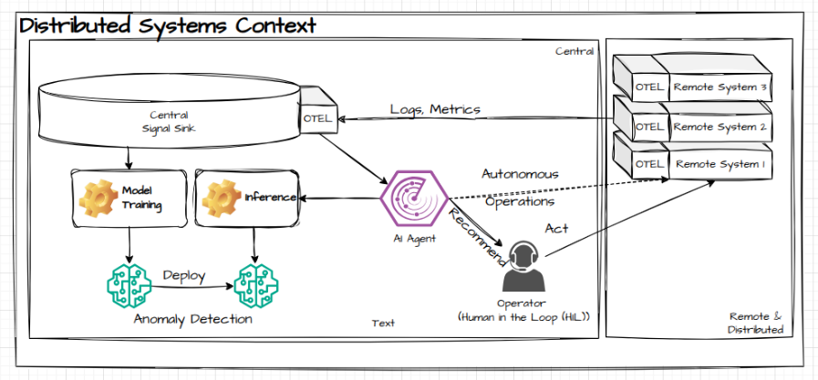

# AIOps - for distributed environments and edge

AIOps under the LFEdge umbrella delivers AI supported operations for heterogeneous and complex edge environments.

## AIOps workflow and high level component overview

## Why it matters
- **Manage Complexity** – Distributed and heterogenous environments can be complex and hard to manage. Hece we are utilizing AI to help secure, fault-find and manage those environments.

- **Adopt** – Due to the vast differences distributed environments have wrt connectivity, workloads and general resource constraints, AIOps trains and finetunes the AI models 'on the job'

- **Scale** – Only AIOps can truly enable growing distributed environments to remain manageable and secure.

## AIOps Component Overview
### Bootstrapping
#### Infra & Runtime (Kind | MicroShift | Fedora)
#### Setup of secure communication infrastructure
#### Deployment, config & localisation
### UI/API
#### Inference | Model selection | Model training | Testing | Rollout
### MLOps
#### Workflows
### AI Engineering
#### AI Model development | training | testing | validation | comparison
### Data Platform & Storage
Data engineering/science | data Pipelines/workflows | data cleansing | Analytics | data collection | storage (Iceberg|MinIO)| data entity models | data query 
###  Security & Trust (cross-cutting) (Lead: Ramki Krishnan)
Platform | Model | MLOps
Encrypted data transfer | storage
Workload identity (SPIFFE | SPIRE | CitadelAI)
Geofencing | non-repudiation | Verifiability
### Inference
Model inference engine
Authentication | authorization
Predictive Models | LLM | RAG (system documentation, data entity information) 
Alerting
### Remediation
Slack | Chatbot | Agents | Automation
### Telemetry
Signal collection | OTEL
Model performance (accuracy), energy consumption,optimized inference
Logging | tracing | metrics 
### Other
Documentation | web-site

## Team
- [Andreas Spanner](https://lf-edge.atlassian.net/wiki/people/59fc56048499730e3412487a?ref=confluence) (Red Hat) (Lead)
- [Ramki Krishnan](https://lf-edge.atlassian.net/wiki/people/557058:c8c42130-9c8b-41ae-b9e2-058af2eff879?ref=confluence) Component Lead - Security
- [Jey Paulraj]  Component Lead - Bootstrapping 
- [Clyde Tedrick]
- [Giri]
- [Prathiba] Component Lead - Data
