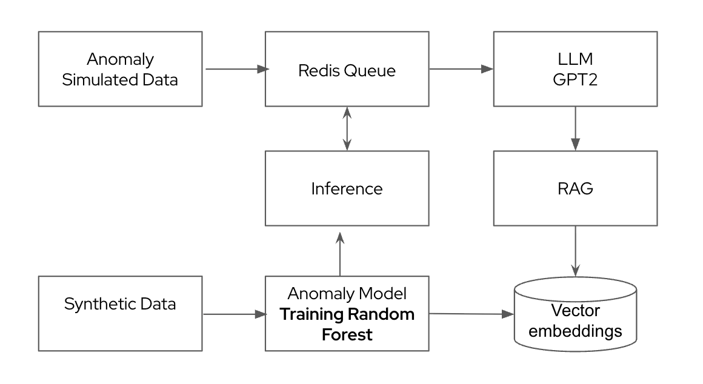

# AIOPS Demo - Anomaly Detection & Remedy Generation using LLM

A multi-stage pipeline for detecting anomalies in CPU and memory usage of edge devices or Kubernetes clusters and generating intelligent remedy content using AI/ML and LLMs.

# Overview:

This Demo provides an end-to-end pipeline that simulates resource usage, detects anomalies, and generates actionable remedies:

1. Simulation: Generates synthetic CPU and memory consumption for edge devices or Kubernetes clusters.

2. Anomaly Detection: Uses a Random Forest model to identify anomalies.

3. Remedy Generation: Uses an LLM-Faiss system to produce context-aware remediation steps.

The pipeline is fully asynchronous and uses Redis queues for communication between components.

## AIOps Demo workflow and high level component overview

[Anomaly Simulation API (CPU/Memory)] --> [Redis Queue] --> [Anomaly Consumer] --> [Random Forest Model]

--> [[Redis Queue]] --> [LLM Consumer] --> [LLM-Faiss] --> Remedy Conent




# Components

**1. Anomaly Simulation API**

Simulates CPU and Memory usage of edge devices or Kubernetes clusters.

Pushes synthetic anomaly events to Redis for downstream processing.

**2. Anomaly Consumer**

Consumes messages from Redis.

Sends the data to the Anomaly Isolation Random Forest Model for anomaly detection.

**3. Anomaly Isolation (Random Forest Model)**

Detects anomalies in resource usage.

Annotates and classifies anomalies.

Pushes detected anomalies back to Redis.

**4. LLM Consumer**

Consumes anomaly messages from Redis.

Sends anomaly data to LLM-Faiss for context-aware remedy generation.

**5. LLM-Faiss**

Generates relevant remedy content using vector search.

Produces actionable insights for alerting or automated remediation.

# Key Features

-  Simulated CPU/Memory metrics for edge devices or Kubernetes clusters.

-  Random Forest-based anomaly detection.

-  LLM-Faiss integration for intelligent remedy content.

-  Fully asynchronous architecture using Redis queues.

# Getting Started and how to run the domo on your local laptop/desktop

**Step :1** Clone the repo from Git repository and navigate to demo folder as shown below

```bash
git clone https://github.com/lfedgeai/AIOps.git

 ```

**Step :2** build image using docker compose :

```bash
    cd AIOps/demo
    docker compose build --no-cache
 ```
**Step :3** run docker compose to start postgres Database and Redis Cache/Queue. Make sure Database and Redis 
started with no errors
```bash
    docker compose  up -d anomaly-db redis
 ```

**Step :4** run docker compose to LLM component. Make sure LLM component
started with no errors

```bash
    docker compose  up -d llm-faiss
 ```

 **Step :4** run docker compose to Anomaly component. Make sure Anomaly component
started with no errors

```bash
    docker compose  up -d anomaly-detection
 ```

A built-in Swagger UI is provided so you can interact with the API directly from your browser.

Open your browser and go to the Swagger API URL (for example: http://localhost:8001/docs).

Use the provided endpoints to trigger synthetic CPU/Memory anomaly data.

GET /generate-anomaly-data/{10}

The events will automatically flow through the pipeline:

Simulation API → Redis Queue → Anomaly Consumer → Random Forest Model → Redis Queue → LLM Consumer → LLM-Faiss → Remedy Content.

To view Anomaly remedy content generated for the detected anomalies.

Use the provided endpoints http://localhost:8002/get-processed-anomalies

or 

Open your browser and go to the Swagger API URL  http://localhost:8002/

GET /generate-anomaly-data/{10}