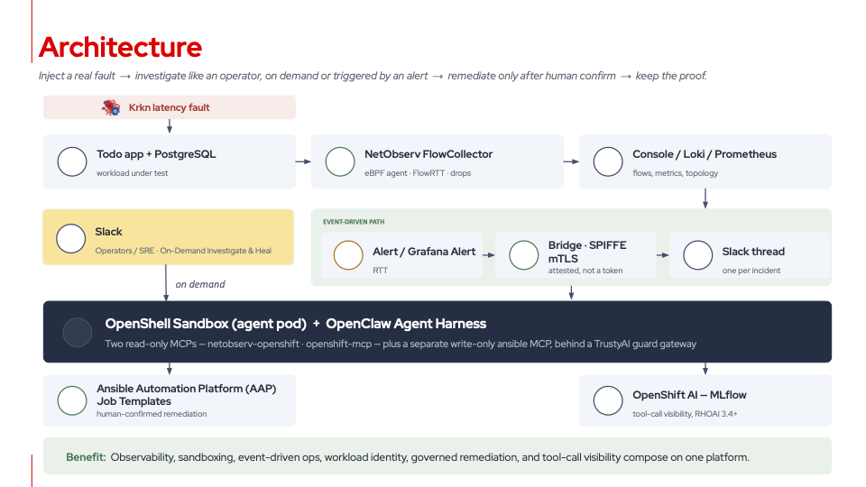

# Governed Agentic AIOps on OpenShift

An AI agent that investigates incidents from measured network evidence and remediates only through pre-approved automation after a human confirms — running on OpenShift, in a sandbox, with its tool calls traced.

▶️ **Watch the demo:** [Agentic AIOps on OpenShift: An AI Agent You'd Actually Let Run](https://youtu.be/W6Xa7socUk0)

> **Lab demonstration.** Some components are upstream, community or Emerging Technologies projects — see [What is supported](#what-is-supported).

---

## What the demo shows

A real network fault is injected on a live application path. An agent investigates it — on demand from Slack or the OpenClaw UI, or automatically from a Grafana alert — captures NetObserv flows, and posts a diagnosis backed by per-flow round-trip time and drop evidence. It then asks before acting. If a human confirms, remediation runs on a separate turn as a pre-approved Ansible job template.

The governance argument rests on four independent controls:

| Control | What it stops |
|---|---|
| Sandboxed agent pod (OpenShell) | A shell escape reaches nothing — no route to the API server |
| Curated tool surface (MCP) | The agent can only do what someone wrote down as a tool |
| Read/write split | Investigation tools cannot mutate anything; one separate server holds the write path |
| Pre-approved automation (AAP) | Remediation is a job template the platform team defines, not a command the model writes |

---

## Architecture



---

## Where to go

| You want to… | Open |
|---|---|
| Install the full stack on a cluster | [`demo-4-greenfield-install/`](demo-4-greenfield-install/) — phased installer and per-phase runbooks |
| Run the demos and prove the controls | [`demo-4-platform-kit/`](demo-4-platform-kit/) — scenarios, proof scripts, and everything the installer deploys |
| Show Network Observability on its own, without an agent | [`demo-4-netobserv-basics/`](demo-4-netobserv-basics/) — the original NetObserv-only lab |

The two `demo-4-*` folders are siblings by design; keep them side by side.

## Quick start

```bash
git clone https://github.com/lfedgeai/AIOps.git
cd AIOps/demo/demo-4-openshift-network-observability/demo-4-greenfield-install
./scripts/greenfield-install.sh config prompt   # AWS, LLM and Slack settings
./scripts/greenfield-install.sh preflight
./scripts/greenfield-install.sh all
```

Prerequisites, the twelve phases, and what each installs: [`demo-4-greenfield-install/README.md`](demo-4-greenfield-install/README.md). Once installed, run the demos from [`demo-4-platform-kit/README.md`](demo-4-platform-kit/README.md).

---

## What is supported

| Component | Status |
|---|---|
| OpenShift, Network Observability, Loki, Red Hat OpenShift AI, Ansible Automation Platform, Red Hat Connectivity Link, Zero Trust Workload Identity Manager | Red Hat products |
| OpenShell and OpenClaw | Emerging Technologies lab ([`redhat-et/openshell-on-openshift-lab`](https://github.com/redhat-et/openshell-on-openshift-lab)) |
| Krkn, MLflow image, OpenTelemetry Collector | Upstream community projects |
