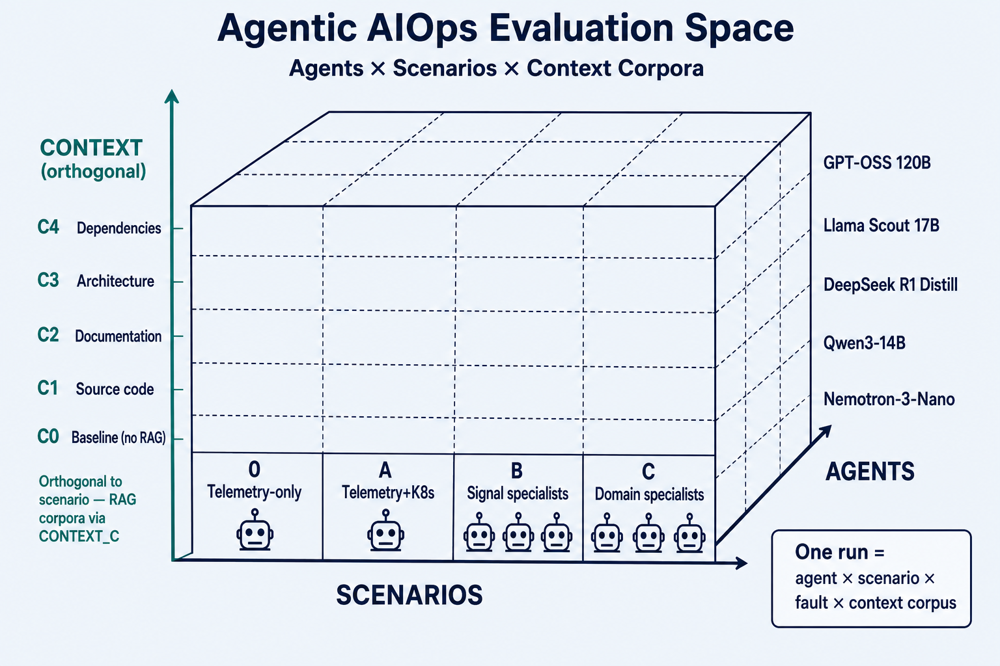

# Agentic AIOps Evaluation Harness

Framework for comparing LLM agents on autonomous fault detection and remediation. Measures MTTD (Mean Time To Detect) and MTTR (Mean Time To Repair) across models, scenarios, and fault types.

## Architecture

- **Telemetry**: OTEL Demo → Collector → ClickHouse in `agentic-aiops` (logs, traces, metrics)
- **Fault injection**: Kubernetes API (scale_zero, kill_pod, memory_limit, network_partition, etc.)
- **Agents**: Nemotron-Nano-3, Qwen3-14B, DeepSeek R1 Distill 14B, Llama Scout 17B, GPT-OSS 120B
- **Experiment tracking**: MLflow (local)
- **No frameworks**: No LangChain, no AutoGen — each agent is a single Python file with a tool-calling loop

Each harness run picks one cell in the evaluation space: **agent × scenario × context** (plus a fault). Context corpora (C0–C4) are orthogonal to scenario topology.



## Quick Start

```bash
# 1. Set up credentials
cp config/.env.example config/.env
# Edit config/.env with your API keys and endpoints

# 2. Deploy / port-forward ClickHouse (observability tier in `agentic-aiops`, not `otel-demo`)
oc apply -f manifests/clickhouse.yaml
python3 scripts/patch-otel-collector-clickhouse.py   # OTEL collector → cross-namespace CH
oc port-forward -n agentic-aiops svc/clickhouse 38123:8123 &

# 3. Start local MLflow
/usr/bin/python3.13 -m mlflow server \
  --backend-store-uri sqlite:///mlflow_local.db \
  --default-artifact-root ./mlartifacts \
  --serve-artifacts --host 0.0.0.0 --port 5050 --workers 1 &

# 4. Run the harness
./scripts/run_harness.sh --scenario a --flag scale_zero --variant cart

# 5. View results
open http://localhost:5050
```

## Fault Types

All faults injected via the Kubernetes API (`code/harness/run_harness.py`):

| `--flag` | What it does | Detection signal | Recovery |
|---|---|---|---|
| `scale_zero` | Scales deployment to 0 replicas | Missing pods, connection errors | Scale to 1 |
| `kill_pod` | Deletes all pods for target | Brief errors, restart events | Self-healing |
| `memory_limit` | Sets 10Mi memory limit (OOMKill) | CrashLoopBackOff, OOMKilled events | Remove limit |
| `network_partition` | Blocks ingress via NetworkPolicy | Connection timeouts, 5xx errors | Delete policy |
| `readiness_probe_fail` | Sets always-failing readiness probe | Pod not ready, removed from endpoints | Remove probe |
| `config_corruption` | Injects invalid DATABASE_HOST env var | Connection errors to bad host | Remove env var |
| `dependency_removal` | Scales a backing service to 0 | Upstream cascade errors | Scale back to 1 |
| `replica_overload` | Scales target to 0 + load-generator to 3 | Service down + high traffic | Restore both |
| `node_taint` | Taints node with NoExecute | All pods evicted, Pending | Remove taint |
| `pvc_full` | Fills 500MB in pod /tmp | Write errors | rm fill file |

Usage: `./scripts/run_harness.sh --flag <fault_type> --variant <deployment_name>`

## Scenarios

Defined in `config/scenarios.yaml`:

| Scenario | Mode | Tools Available | Purpose |
|---|---|---|---|
| **0** | Single agent | Telemetry only (search_logs, search_traces, search_metrics) | Baseline — can telemetry alone detect? |
| **a** | Single agent | Telemetry + K8s (+ get_pod_status, get_events, restart_deployment, scale_deployment, delete_pod) | Full autonomous — detect + diagnose + fix |
| **b** | Multi-agent | logs_only / traces_only / metrics_only specialists | Does signal specialization help? |
| **c** | Multi-agent | hardware / platform / application domain specialists | Does domain specialization help? |

Usage: `./scripts/run_harness.sh --scenario a` or `--all-scenarios`

## Agents

| Agent | Model | Tool calling | Env vars |
|-------|-------|-------------|----------|
| `nemotron_agent/` | NVIDIA Nemotron-3-Nano | Native + reasoning | `NEMOTRON_API_KEY`, `NEMOTRON_API_BASE` |
| `qwen3_agent/` | Qwen3-14B | Native + streaming | `QWEN3_API_KEY`, `QWEN3_API_BASE` |
| `deepseek_agent/` | DeepSeek R1 Distill 14B | Prompt-based | `DEEPSEEK_API_KEY`, `DEEPSEEK_API_BASE` |
| `llama_scout_agent/` | Llama Scout 17B | Native | `LLAMA_SCOUT_API_KEY`, `LLAMA_SCOUT_API_BASE` |
| `gpt_oss_agent/` | GPT-OSS 120B | Native | `GPT_OSS_API_KEY`, `GPT_OSS_API_BASE` |

All credentials in `config/.env` (gitignored). `run_harness.sh` sources it automatically.

## Metrics

| Metric | Definition |
|--------|-----------|
| **MTTD** | `fault_injection → detection` (when agent decides there's a fault) |
| **MTTR** | `fault_injection → system fixed` (when agent's write tool succeeds) |
| **Remediation Time** | `detection → system fixed` (MTTR - MTTD) |
| **MTTR = None** | Agent detected but did not execute a fix |

AI performance metrics (per run): TTFT, tokens/sec, total tokens, tool calls, LLM rounds.

## Full Matrix Run

```bash
# Run all agents × all faults on scenario a (~2.5 hours)
bash scripts/run_full_matrix.sh
```

## Project Structure

```
code/
├── harness/           # Orchestration (run_harness.py, scenarios.py)
├── agents/            # One dir per model (nemotron, qwen3, deepseek, llama_scout)
│   └── ai_metrics.py # Shared TTFT/token/latency tracking
└── tools/             # Shared tools (agent_tools.py, tool_profiles.py)
config/                # .env, harness.yaml, scenarios.yaml
scripts/               # run_harness.sh, run_full_matrix.sh
manifests/             # OpenShift deployments (mlflow, clickhouse, vllm)
docs/                  # Architecture, credentials, results
out/                   # Run output JSONs (gitignored)
```

## Docs

- [EVALUATION_RESULTS_23June26.md](docs/EVALUATION_RESULTS_23June26.md) — Full matrix results (128 runs)
- [CONTEXT_ENGINEERING_EVAL_REPORT.md](docs/CONTEXT_ENGINEERING_EVAL_REPORT.md) — Context levels L0–L2 eval (Nemotron)
- [ARCHITECTURE.md](docs/ARCHITECTURE.md) — Current system architecture
- [LLM_CREDENTIALS.md](docs/LLM_CREDENTIALS.md) — API key setup
- [OPENSHIFT_OTEL_DEPLOYMENT.md](docs/OPENSHIFT_OTEL_DEPLOYMENT.md) — OpenShift deployment

## Backlog

- Multi-model pipeline — fast detection → deep RCA → constrained remediation with different models per stage
- Agent self-verification — after fix, poll get_pod_status to confirm recovery before reporting success
- Reinforcement loop — use results to improve prompts automatically
- Local ClickHouse — run telemetry DB locally so harness works without OpenShift
